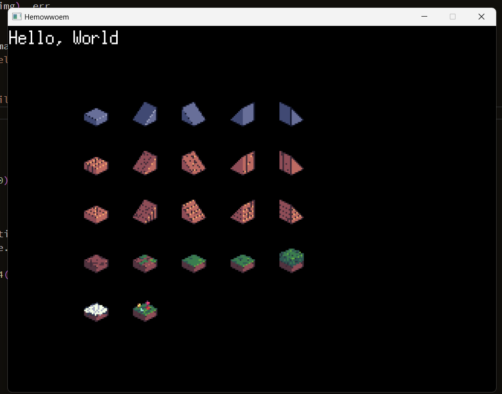

I'm getting back into gamedev slowly

I wanted to do something in `Rust`

Then `Godot 4` (whenever that is stable)

But now due to...external ideas, `go`

More specifically `ebitengine` (terrible name, nice engine with a wacky concept)

HOLY SHIT THIS THEME DOESN'T DISPLAY IAMGES
<!--  -->

We'll see where this goes, if anywhere
